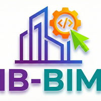

# 🧩 IB-BIM Visibility Manager — Guía del Usuario

  

<h1 align="center">IB-BIM Visibility Manager</h1>

Documentación Profesional

<!-- Language Selector -->

<table>
<tr>
<td align="center" style="padding: 8px 12px;"><a href="../">🇬🇧 English</a></td>
<td align="center" style="padding: 8px 12px;"><a href="../ar/">🇸🇦 العربية</a></td>
<td align="center" style="padding: 8px 12px;"><a href="../ko/">🇰🇷 한국어</a></td>
<td align="center" style="padding: 8px 12px;"><a href="./">🇪🇸 <strong>Español</strong></a></td>
<td align="center" style="padding: 8px 12px;"><a href="../pt/">🇧🇷 Português</a></td>
</tr>
</table>

Documentación oficial del usuario para el complemento **IB-BIM Visibility Manager** para Autodesk® Revit®.
Este repositorio proporciona la **guía del usuario pública**, capturas de pantalla y documentación relacionada para la aplicación publicada en la Autodesk App Store.

---

## 📘 Acerca del Complemento
**IB-BIM Visibility Manager** ayuda a los usuarios de Revit a gestionar eficientemente:
- Filtros de vista y anulaciones VG (Visibility/Graphics)
- Todas las categorías de Revit: Modelo, Anotación y Analítica
- Copiar, eliminar, exportar e importar configuraciones entre vistas y plantillas
- Mantener la consistencia visual y optimizar los flujos de trabajo de coordinación

Soporta **todas las categorías principales** en Revit 2023–2026 (ej. 292 categorías en Revit 2025/2026).
Se integra en la cinta de Revit bajo la pestaña **IB-BIM**.

---

## 📄 Documentación

👉 **[Guía del Usuario Completa](./UserGuide.md)**

👉 **[Preguntas Frecuentes (FAQ)](./FAQ.md)**

---

## 🖼️ Vista Previa

| Modo Filtros | Modo Anulaciones VG |
|-------------|---------------------|
|  |  |

---

## 🔒 Política de Privacidad
La política de privacidad para todas las aplicaciones IB-BIM está disponible aquí:
👉 [Ver Política de Privacidad](https://itzikb49.github.io/ib-bim-privacy/)
